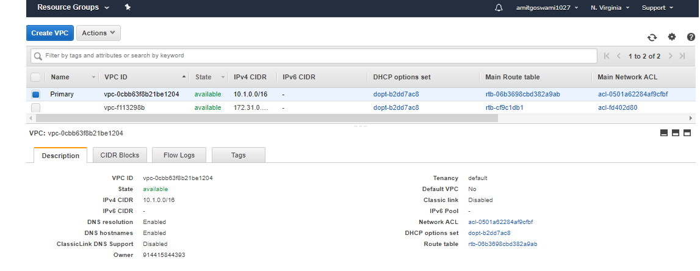
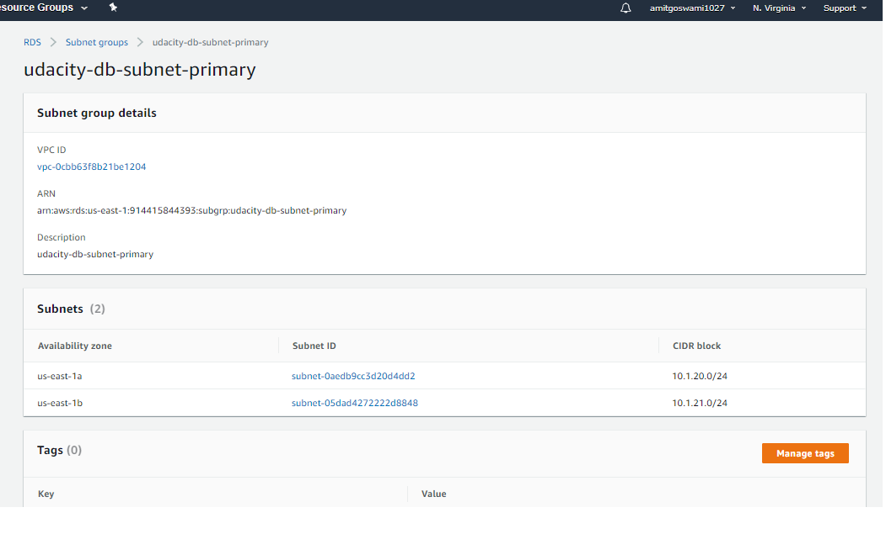
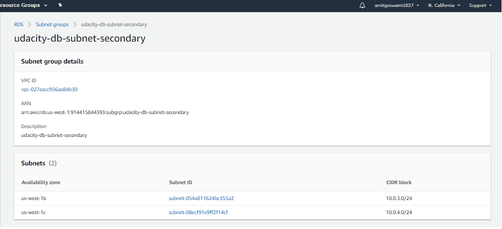
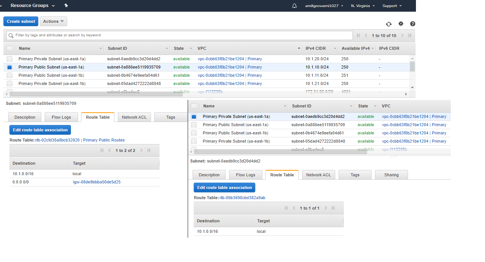
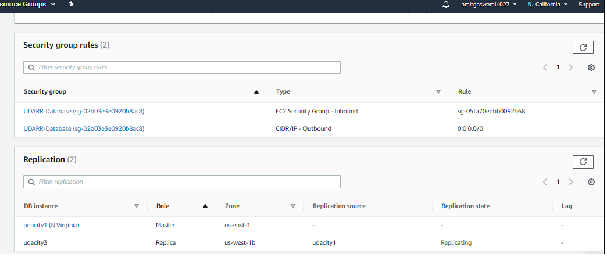

## AWS CLOUD ARCHITECT - Nanodegree 

### Review Comments for the Project-1 - Data Durability and Recovery
#### Review-01: Screenshot of a MySQL database configured to run in multiple availability zones in the "Primary" VPC. Database must have automatic backups enabled and be in a private subnet.Screenshot of route tables for the configured database subnets.
* [Comment] : primary_subnet_routing.png should show the routing for the private sunbet. primaryDB_config.png should show the 
Configuration tab and the multi-az parameter as 'Yes'.
* [private subnet.Screenshot]
  
  
* [primaryDB_config- primaryDB_config.png should show the Configuration tab and the multi-az parameter as 'Yes']
  
#### Review-02: Screenshot of a read-replica MySQL database configured to run in the "Secondary" VPC. Database must be in a private subnet. Screenshot of route tables for the configured database subnets
* [Comment]:Secondary_subnet_routing.png should show the routing for the private sunbet.Secondary_config.png should show the 
Configuration tab.
* [Secondary_subnet_routing]
  
  
* [Secondary_config.png should show the Configuration tab.]
  
#### Review-03 : Paragraph describing the Recovery Time Objective (RTO) and Recovery Point Objective (RPO) of this database configuration.
*[Comment] :Re-think this part. You're expected to provide estimate in minutes / hours for each case.
Write a paragraph or two describing the achievable Recovery Time Objective (RTO) and Recovery Point Objective (RPO) for this Multi-AZ, multi-region database in terms of:
1. Minimum RTO for a single AZ outage : 
2. Minimum RTO for a single region outage
3. Minimum RPO for a single AZ outage
4. Minimum RPO for a single region outage
[My Thoughts on the same]
* If an RDS database instance's volumes are lost, requiring recreating it from backup, then the RPO for Single-AZ, Multi-AZ, and even 
  is typically around 5 minutes. That is the target interval for RDS to perform log backups to S3, so on a database volume loss you 
  could have 5 minutes of log data that is also lost. There is no way to change the log backup interval.
* With Single-AZ the only live copy of your data is the EBS volume that holds the data for the instance. While EBS uses mirroring of 
  data under the covers to provide durability and availability, there are several scenarios where you would have no choice other than to 
  recover from backups. In this case you might want to apply the 5 minute log backup interval as your RPO.
* With Multi-AZ the odds of data loss go way down because we have a separate synchronous copy of the volume being maintained in a 
  separate data center (AZ). If the primary instance fails, we failover to the secondary instance with no data loss.Since volume-level 
  replication is used, a corruption on the primary's volume may be replicated to the secondary's volume. I believe most customers think 
  of Multi-AZ as having an RTO of 1-2 minutes and an RPO of 0, since they lose no data on any common failure. Again putting this into 
  more traditional terms, even if a natural disaster were to destroy the data center housing the primary, the secondary would take over 
  with no data loss. So assuming an RPO of 0 makes sense.

#### Review-04: Screenshot of “Database connections” metric of database. Screenshot showing database replica configuration.
* [Comment]: monitoring_replication.png should show the replication status as 'Replicating'
  
#### Review-05: Screenshot of the read-replica database before promotion.,Another screenshot after promotion. Log of the student connecting to, reading from, and writing to the database in the standby region, after promotion.
* [Comment] : Can you please provide screenshot for the database before and after the promotion. I only see rr_after_promotion.png.
* screenshots/log_rr_before_promotion.png & screenshots/log_rr_after_promotion.png files. Kindly refer. 

# Project01
# Data Durability and Recovery
In this project you will create highly available solutions to common use cases. You will build a Multi-AvailabilityZone, Multi-Region database and show how to use it in multiple geographically separate AWS regions. You will also build a website hosting solution that is versioned so that any data destruction and accidents can be quickly and easily undone.

## Getting Started
To get started, clone this repo.  Aside from instructions, it contains a CloudFormation script to build an AWS VPC with public and private subnets.  It also contains an example website that you will host in an AWS S3 bucket in your account.

## Project Instructions
### Cloud formation
In this project, you will use the AWS CloudFormation to create Virtual Private Clouds. CloudFormation is an AWS service that allows you to create "infrastructure as code". This allows you to define the infrastructure you'd like to create in code, just like you do with software. This has the benefits of being able to share your infrastructure in a common language, use source code control systems to version your infrastructure and allows for documenting and reviewing of infrastructure and infrastructure proposed changes.

CloudFormation allows you to use a configuration file written in a YAML file to automate the creation of AWS resources such as VPCs. In this project, you will use a pre-made CloudFormation template to get you started. This will allow you to create some of the infrastructure that you'll need without spending a lot of time learning details that are beyond the scope of this course.

You can find the YAML file in the GitHub repo: https://github.com/udacity/nd063-c2-design-for-availability-resilience-reliability-replacement-project-starter-template/blob/master/cloudformation/vpc.yaml

## Part-01 - [Done]
Complete the following steps:
### Data durability and recovery
In order to achieve the highest levels of durability and availability in AWS you must take advantage of multiple AWS regions. 
1. Pick two AWS regions. An active region(us-east-1) and a standby region(us-west-1).
2. Use CloudFormation to create one VPC in each region. Name the VPC in the active region "Primary" and name the VPC in the standby region "Secondary". 
* Primary VPC (us-east-1) - 10.1.0.0/16 with Subnets : 10.1.10.0/24; 10.1.11.0/24;10.1.20.0/24;10.1.21.0/24
* Secondary VPC (us-west-1) - 10.0.0.0/16 with Subnets : 10.0.1.0/24;10.0.2.0/24;10.0.3.0/24;10.0.4.0/24;

##### [Enclosed snapshots screenshots/]
**NOTE**: Be sure to use different CIDR address ranges for the VPCs.
**SAVE** screenshots of both VPCs after they are created. Name your screenshots: primary_Vpc.png, secondary_Vpc.png




### Highly durable RDS Database
1. Create a new RDS Subnet group in the active(us-east-1) and standby(us-west-1) region. -Done
   ### DB subnet group creation
   * [us-east-1] : RDS Screen, create the Primary DB subnet group. Choose the private subnets while creating the DB Subnet group.
   * [us-west-1] : RDS Screen, create the Secondary DB subnet group. Choose the private subnets while creating the DB Subnet group.
2. Create a new MySQL, multi-AZ database in the active(us-east-1) region. The database must:
     - Be a “burstable” instance class.
     - Have only the “UDARR-Database” security group.
     - Have an initial database called “udacity.”
3. Create a read replica database in the standby(us-west-1) region. This database has the same requirements as the database in the 
   active region. 

##### [Enclosed snapshots screenshots/]
**SAVE** screenshots of the configuration of the databases in the active and secondary region after they are created. 


**SAVE** screenshots of the configuration of the database subnet groups as well as route tables associated with those subnets. Name the screenshots: primaryDB_config.png, secondaryDB_config.png, primaryDB_subnetgroup.png, secondaryDB_subnetgroup.png, primaryVPC_subnets.png, secondaryVPC_subnets.png, primary_subnet_routing.png, secondary_subnet_routing.png







### Estimate availability of this configuration
Write a paragraph or two describing the achievable Recovery Time Objective (RTO) and Recovery Point Objective (RPO) for this Multi-AZ, multi-region database in terms of:

1. Minimum RTO for a single AZ outage
2. Minimum RTO for a single region outage
3. Minimum RPO for a single AZ outage
4. Minimum RPO for a single region outage

##### [Enclosed snapshots screenshots/]
**SAVE** your answers in a text file named "estimates.txt"

### Demonstrate normal usage
In the active region(us-east-1):
1. Create an EC2 keypair in the region
2. Launch an Amazon Linux EC2 instance in the active region. Configure the instance to use the VPC's public subnet and security group ("UDARR-Application"). 
3. SSH to the instance and connect to the "udacity" database in the RDS instance. 
   * Connect to the EC2 instance using putty.
   * aws configure, to configure the aws cli credentials.
   * sudo yum updates
   * Install mysql client / yum install mysql
   * mysql -u udacity1 -p -h udacity1.cvqgygxhhehg.us-east-1.rds.amazonaws.com
   * mysql -u udacity1 -p -h udacity1.cfcesfue6o5g.us-west-1.rds.amazonaws.com
   * Other Commands
     ```
     wget https://s3.amazonaws.com/rds-downloads/rds-combined-ca-bundle.pem
     RDSHOST="udacity1.cvqgygxhhehg.us-east-1.rds.amazonaws.com"
     TOKEN="$(aws rds generate-db-auth-token --hostname $RDSHOST --port 3306 --region us-east-1a --username amitgoswami1027)"
     mysql --host=$RDSHOST --port=3306 --ssl-ca=rds-combined-ca-bundle.pem --user=amitgoswami1027 --password=$TOKEN
     ```
4. Verify that you can create a table, insert data, and read data from the database. 
   * One MySQL Prompt, select the database by running the command: "USE udacity1"
   ```
   CREATE TABLE pet (name VARCHAR(20), owner VARCHAR(20), species VARCHAR(20), sex CHAR(1), birth DATE, death DATE);
   INSERT INTO pet VALUES ('Puffball','Diane','hamster','f','1999-03-30',NULL);
   INSERT INTO pet VALUES ('Puffball1','Amit','german','f','1999-03-30',NULL);
   INSERT INTO pet VALUES ('Puffball2','Sumit','germanshperd','f','1999-03-30',NULL);
   SELECT * from pet;
   ```
5. You have now demonstrated that you can read and write to the primary database
https://dev.mysql.com/doc/refman/5.7/en/getting-information.html
##### [Enclosed snapshots screenshots/]
**SAVE** the log of connecting to the database, creating the table, writing to and reading from the table in a text file called "log_primary.txt"

### Monitor database
1. Observe the “DB Connections” to the database and how this metric changes as you connect to the database
2. Observe the “Replication” configuration with your multi-region read replica. 

**SAVE** screenshots of the DB Connections and the database replication configuration. Name your screenshots: monitoring_connections.png, monitoring_replication.png



## Part 2
### Failover And Recovery
In the standby region:
1. Create an EC2 keypair in the region
2. Launch an Amazon Linux EC2 instance in the standby region. Configure the instance to use the VPC's public subnet and security group ("UDARR-Application").
3. SSH to the instance and connect to the read replica database.
   * Connect to the EC2 instance using putty.
   * aws configure, to configure the aws cli credentials.
   * sudo yum updates
   * Install mysql client / yum install mysql
   * mysql -u udacity1 -p -h udacity1.cfcesfue6o5g.us-west-1.rds.amazonaws.com
4. Verify if you are not able to insert data into the database but are able to read from the database.
   * INSERT INTO pet VALUES ('Puffball5','Aryan','germanshperd','f','1999-03-30',NULL);
5. You have now demonstrated that you can only read from the read replica database.

##### [Enclosed snapshots screenshots/]
**SAVE** log of connecting to the database, writing to and reading from the table in a text file called "log_rr_before_promotion.txt"


**SAVE** screenshot of the database configuration now, before promoting the read replica database in the next step. Name your screenshot: rr_before_promotion.png


6. Promote the read replica
7. Verify that if you are able to insert data into and read from the read replica database.
8. You have now demonstrated that you can read and write the promoted database in the standby region.
##### [Enclosed snapshots screenshots/]
**SAVE** log of connecting to the database, writing to and reading from the database in a text file named "log_rr_after_promotion.txt"


**SAVE** screenshots of the database configuration after the database promotion. Name your screenshot: rr_after_promotion.png


## Part 3
## Website Resiliency
Build a resilient static web hosting solution in AWS. Create a versioned S3 bucket and configure it as a static website.
1. Enter “index.html” for both Index document and Error document
2. Upload the files from the GitHub repo (under `/project/s3/`)
3. Paste URL into a web browser to see your website. 

**Save** the screenshot of the webpage. Name your screenshot "s3_original.png"


You will now “accidentally” change the contents of the website such that it is no longer serving the correct content

1. Change `index.html` to refer to a different “season” [Changed the "winter season" to "summer"]
2. Re-upload `index.html`
3. Refresh web page
##### [Enclosed snapshots screenshots/]
**SAVE** a screenshot of the modified webpage. Name your screenshot "s3_season.png"


You will now need to “recover” the website by rolling the content back to a previous version.

1. Recover the `index.html` object back to the original version
2. Refresh web page
##### [Enclosed snapshots screenshots/]
**SAVE** a screenshot of the modified webpage. Name your screenshot "s3_season_revert.png"


You will now “accidentally” delete contents from the S3 bucket. Delete “winter.jpg”

**SAVE** screenshots of the modified webpage and of the existing versions of the file showing the "Deletion marker". Name your screenshots: s3_deletion.png, s3_delete_marker.png


You will now need to “recover” the object:
1. Recover the deleted object
2. Refresh web page

**SAVE** a screenshot of the modified webpage. Name your screenshot "s3_delete_revert.png"
##### [Enclosed snapshots screenshots/]


### IMPORTANT LINKS FOR READING
* Global Infrastructure : https://aws.amazon.com/about-aws/global-infrastructure/
* Case Studies: https://aws.amazon.com/solutions/case-studies/?customer-references-cards.sort-by=item.additionalFields.publishedDate&customer-references-cards.sort-order=desc
* AWS Realiability Pillar : https://d1.awsstatic.com/whitepapers/architecture/AWS-Reliability-Pillar.pdf
* CIDR : https://en.wikipedia.org/wiki/Classless_Inter-Domain_Routing
* NAT: https://en.wikipedia.org/wiki/Network_address_translation
* WannaCry ransomware attack: https://en.wikipedia.org/wiki/WannaCry_ransomware_attack
* S3 Pricing: https://aws.amazon.com/s3/pricing/
* HIGH AVAILABILITY - NO OF NINES : https://en.wikipedia.org/wiki/High_availability
* Atlassian Incident Handbook : https://www.atlassian.com/incident-management/handbook/postmortems#postmortem-issue-fields
* GitHub Post-incident analysis: https://github.blog/2018-10-30-oct21-post-incident-analysis/
* AWS Services That Publish CloudWatch Metrics : https://docs.aws.amazon.com/AmazonCloudWatch/latest/monitoring/aws-services-cloudwatch-metrics.html
* https://acloud.guru/forums/aws-certified-solutions-architect-professional/discussion/-Kd8syzv_aNQL4rjvP5A/i_passed_certified_solutions_a
* RTO/RPO : https://cdn2.hubspot.net/hubfs/2512652/CloudBerry_Lab_Whitepaper_A_Complete_Guide_for_Backup_and_DR_on_AWS.pdf
* RTO/RPO Imp Read: https://forums.aws.amazon.com/thread.jspa?threadID=310192
